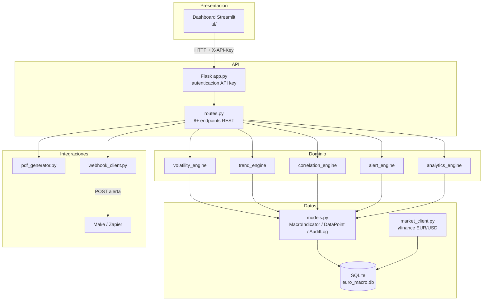
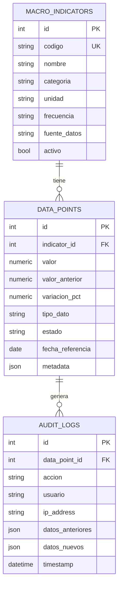
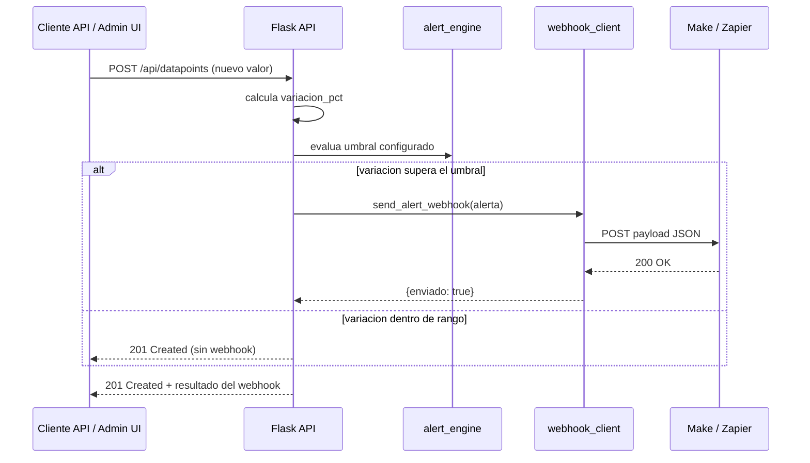

# 2. Arquitectura general y diagramas

## 2.1 Visión general

La plataforma sigue una **arquitectura en capas desacopladas**, inspirada
en el patrón usado en el proyecto de referencia `TRABAJO_FINAL_AUTOMATIZACION`,
pero adaptada al dominio macroeconómico y partiendo de la base de datos del
proyecto `grupo1_actividad2_automatizacion`. Cada capa solo conoce a la capa
inmediatamente inferior, nunca salta capas:

```
Dashboard (Streamlit)  →  API REST (Flask)  →  Motores de dominio  →  Capa de datos (SQLAlchemy)
     ui/                      api/                  domain/              data_layer/
```

El dashboard **nunca** consulta la base de datos directamente: todo pasa
por la API, incluso cuando ambos corren en la misma máquina. Esto permite,
sin cambiar una línea del dashboard, desplegar la API en un servidor
distinto en el futuro.

## 2.2 Diagrama de componentes



## 2.3 Diagrama entidad-relación (base de datos)



## 2.4 Flujo de una alerta de extremo a extremo



## 2.5 Organización del sistema (estructura de carpetas)

```
euro-macro-platform/
├── config.py              # Configuración centralizada (.env)
├── app_streamlit.py        # Punto de entrada del dashboard
├── requirements.txt
├── .env.example
│
├── data_layer/             # Capa de datos
│   ├── db.py                #   conexión SQLAlchemy, sesión
│   ├── models.py             #   MacroIndicator, DataPoint, AuditLog
│   ├── market_client.py      #   ingesta real EUR/USD (yfinance)
│   └── seed_data.py          #   datos iniciales (reales + simulados)
│
├── domain/                 # Motores de análisis (lógica de negocio pura)
│   ├── volatility_engine.py
│   ├── trend_engine.py
│   ├── correlation_engine.py
│   ├── alert_engine.py
│   └── analytics_engine.py
│
├── api/                    # API REST
│   ├── app.py                #   app factory, middleware de API key
│   └── routes.py             #   endpoints
│
├── ui/                      # Dashboard
│   ├── api_client.py         #   cliente HTTP hacia la API
│   ├── chart_utils.py         #   transformaciones puras para gráficos
│   ├── tab_overview.py
│   ├── tab_series.py
│   ├── tab_correlations.py
│   ├── tab_alerts.py
│   └── tab_admin.py
│
├── reports/
│   └── pdf_generator.py      #   generación de reportes PDF
│
├── integrations/
│   └── webhook_client.py     #   webhook saliente Make/Zapier
│
├── scripts/
│   └── init_db.py            #   inicialización + seed de la BD
│
├── tests/                   # 37 pruebas automatizadas
└── docs/                    # esta documentación
```

## 2.6 Librerías utilizadas

| Librería | Uso en el proyecto |
|---|---|
| `SQLAlchemy` | ORM y capa de acceso a datos, independiente del framework web |
| `Flask` + `flask-cors` | API REST y CORS para el consumo desde el dashboard |
| `streamlit` | Dashboard interactivo |
| `plotly` | Gráficos de series temporales y mapa de calor de correlaciones |
| `pandas` | Alineación de series de distinta frecuencia para el cálculo de correlaciones |
| `numpy` | Soporte numérico (usado indirectamente vía pandas) |
| `yfinance` | Ingesta real de la cotización EUR/USD |
| `reportlab` | Generación de los reportes PDF |
| `requests` | Cliente HTTP del dashboard hacia la API, y del webhook hacia Make/Zapier |
| `python-dotenv` | Carga de variables de entorno desde `.env` |
| `pytest` | Framework de pruebas automatizadas |
